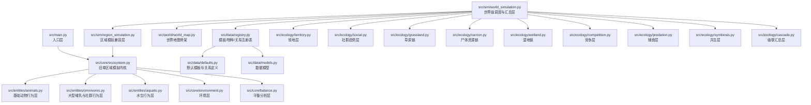
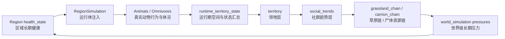

# Code Review Graph 工作流说明

## 术语对照

- `workflow`：工作流，也就是一套固定的使用步骤。
- `graph`：图谱，这里指代码之间的依赖关系图、影响面图和评审路径图。
- `entry node`：入口节点，也就是最适合开始阅读的起点文件。
- `hub`：枢纽文件，也就是被很多模块依赖、改动影响面很大的核心文件。
- `fan-out`：外扩影响，表示一个文件改动后会继续影响很多下游模块。
- `feedback loop`：反馈闭环，表示一个变化绕一圈后又会反过来影响起点。
- `review path`：评审路径，表示 code review 时建议按什么顺序阅读文件。
- `hotspot`：热点文件，表示改动频繁、耦合高、风险高的文件。

## 这份文档解决什么问题

这份文档专门回答两件事：

1. 这个项目后续应该怎么用 `code-review-graph`
2. 这个项目当前的 graph 大致长什么样

对这个仓库来说，`code-review-graph` 的价值不在“画一个好看的图”，而在：

- 缩小 review 范围
- 优先阅读真正高耦合的文件
- 降低无效上下文和 token 浪费
- 帮助识别下一步该拆哪个模块

## 当前项目的 graph 是什么样的

当前仓库最核心的主图谱，不是“所有文件平铺”，而是一个明显的多层结构。

### 总体层级图

### 当前真正的 review 枢纽

如果只看当前 `v4` 主线，这个项目的 graph 里有 5 个真正的枢纽文件：

- [src/sim/world_simulation.py](/Users/yumini/Projects/eco-world/src/sim/world_simulation.py)
- [src/sim/region_simulation.py](/Users/yumini/Projects/eco-world/src/sim/region_simulation.py)
- [src/ecology/social.py](/Users/yumini/Projects/eco-world/src/ecology/social.py)
- [src/ecology/territory.py](/Users/yumini/Projects/eco-world/src/ecology/territory.py)
- [src/core/ecosystem.py](/Users/yumini/Projects/eco-world/src/core/ecosystem.py)

这 5 个文件的特点是：

- 读一个文件，就能看到很多下游模块
- 改一个文件，常常会波及很多摘要层、反馈层和运行体
- 它们是最适合先做 graph review 的入口

### 当前最明显的 v4 闭环

这个仓库当前最关键的 graph，不是简单的树，而是闭环。

这就是当前最值得用 `code-review-graph` 观察的一条线。  
因为它已经不是简单依赖，而是：

- 区域长期状态
- 运行体行为
- 领地与社群趋势
- 链路反馈
- 世界级压力
- 再回到区域长期状态

## 这个项目最像什么图

一句话总结：

**它现在不是“分层架构图”，而是“以 world_simulation 为中心的多环反馈图”。**

更具体一点：

- `world_simulation` 是总调度中心
- `region_simulation` 是旧内核和新系统之间的桥
- `territory + social` 是长期趋势中间层
- `grassland + carrion + wetland` 是区域生态链层
- `animals + omnivores` 是运行体行为层
- `core/ecosystem` 仍然是底层兼容内核

## 这个 graph 里最容易出问题的地方

如果用 review 视角看，当前图谱里风险最高的不是单个 bug，而是“耦合继续变厚”。

最值得盯的 5 个风险点：

1. [src/ecology/social.py](/Users/yumini/Projects/eco-world/src/ecology/social.py)  
   风险：越来越像“大一统长期趋势层”。

2. [src/sim/world_simulation.py](/Users/yumini/Projects/eco-world/src/sim/world_simulation.py)  
   风险：承担太多世界级汇总和回灌职责。

3. [src/sim/region_simulation.py](/Users/yumini/Projects/eco-world/src/sim/region_simulation.py)  
   风险：成为“所有 runtime 注入都往这里塞”的兼容层。

4. [src/entities/omnivores.py](/Users/yumini/Projects/eco-world/src/entities/omnivores.py)  
   风险：狮、鬣狗、大型植食者的社群字段和运行偏置继续膨胀。

5. [src/core/ecosystem.py](/Users/yumini/Projects/eco-world/src/core/ecosystem.py)  
   风险：本来应该逐步退居底层兼容内核，但仍然有继续变厚的可能。

## 这个项目怎么用 graph

### 工作流 1：做大改前的影响面扫描

适用场景：

- 要改 [src/sim/world_simulation.py](/Users/yumini/Projects/eco-world/src/sim/world_simulation.py)
- 要改 [src/ecology/social.py](/Users/yumini/Projects/eco-world/src/ecology/social.py)
- 要改 [src/ecology/territory.py](/Users/yumini/Projects/eco-world/src/ecology/territory.py)

建议步骤：

1. 先看这个文件连到哪些生态链模块
2. 再看它会回灌哪些运行体
3. 最后只打开受影响的关键文件，不要全仓库展开

对这个项目，典型阅读顺序是：

1. [src/sim/world_simulation.py](/Users/yumini/Projects/eco-world/src/sim/world_simulation.py)
2. [src/ecology/social.py](/Users/yumini/Projects/eco-world/src/ecology/social.py)
3. [src/ecology/territory.py](/Users/yumini/Projects/eco-world/src/ecology/territory.py)
4. [src/ecology/grassland.py](/Users/yumini/Projects/eco-world/src/ecology/grassland.py)
5. [src/ecology/carrion.py](/Users/yumini/Projects/eco-world/src/ecology/carrion.py)
6. [src/sim/region_simulation.py](/Users/yumini/Projects/eco-world/src/sim/region_simulation.py)
7. [src/entities/animals.py](/Users/yumini/Projects/eco-world/src/entities/animals.py) / [src/entities/omnivores.py](/Users/yumini/Projects/eco-world/src/entities/omnivores.py)

### 工作流 2：做 PR review

适用场景：

- 某次 PR 改了 8 个以上文件
- 同时涉及 `sim + ecology + entities`

建议先按 graph 分组，而不是按文件名顺序 review：

- 世界调度组
  - [src/sim/world_simulation.py](/Users/yumini/Projects/eco-world/src/sim/world_simulation.py)
  - [src/sim/region_simulation.py](/Users/yumini/Projects/eco-world/src/sim/region_simulation.py)
- 长期趋势组
  - [src/ecology/social.py](/Users/yumini/Projects/eco-world/src/ecology/social.py)
  - [src/ecology/territory.py](/Users/yumini/Projects/eco-world/src/ecology/territory.py)
- 草原链组
  - [src/ecology/grassland.py](/Users/yumini/Projects/eco-world/src/ecology/grassland.py)
  - [src/ecology/carrion.py](/Users/yumini/Projects/eco-world/src/ecology/carrion.py)
- 运行体组
  - [src/entities/animals.py](/Users/yumini/Projects/eco-world/src/entities/animals.py)
  - [src/entities/omnivores.py](/Users/yumini/Projects/eco-world/src/entities/omnivores.py)

这样评审效率会明显高于“按 git diff 顺序一路看下去”。

### 工作流 3：找下一步该拆哪个模块

适用场景：

- 你感觉系统越来越复杂
- 想知道下一步该拆 `social` 还是拆 `world_simulation`

建议看 graph 里的两个指标：

- 谁接收输入最多
- 谁输出到别的模块最多

按当前代码结构，优先怀疑对象是：

1. [src/ecology/social.py](/Users/yumini/Projects/eco-world/src/ecology/social.py)
2. [src/sim/world_simulation.py](/Users/yumini/Projects/eco-world/src/sim/world_simulation.py)
3. [src/sim/region_simulation.py](/Users/yumini/Projects/eco-world/src/sim/region_simulation.py)

## 对 token 消耗的帮助

`code-review-graph` 对 token 的帮助，不是“直接压缩 token”，而是：

- 减少无效阅读
- 减少错误展开
- 降低把整个仓库都扫一遍的概率

对于这个项目尤其有效，因为它现在已经不是简单仓库，而是：

- 有多层模块
- 有多条反馈闭环
- 有高耦合核心文件

如果不用 graph，很容易一次把：

- `world_simulation`
- `social`
- `territory`
- `grassland`
- `carrion`
- `animals`
- `omnivores`
- `ecosystem`

全部读深，token 很快就会被无效上下文吃掉。  
如果用 graph，通常可以先锁定 3 到 6 个核心文件。

## 结论

这个项目当前的 graph，不是“单向模块树”，而是：

**一个以 [src/sim/world_simulation.py](/Users/yumini/Projects/eco-world/src/sim/world_simulation.py) 为调度中心、以 [src/ecology/social.py](/Users/yumini/Projects/eco-world/src/ecology/social.py) 和 [src/ecology/territory.py](/Users/yumini/Projects/eco-world/src/ecology/territory.py) 为长期趋势中间层、以运行体和区域链条共同构成的多环反馈图。**

后续如果要用 `code-review-graph`，最应该优先看的不是“全仓库平铺图”，而是：

- 主调度图
- 草原长期闭环
- 运行体回灌路径
- 高耦合热点文件
